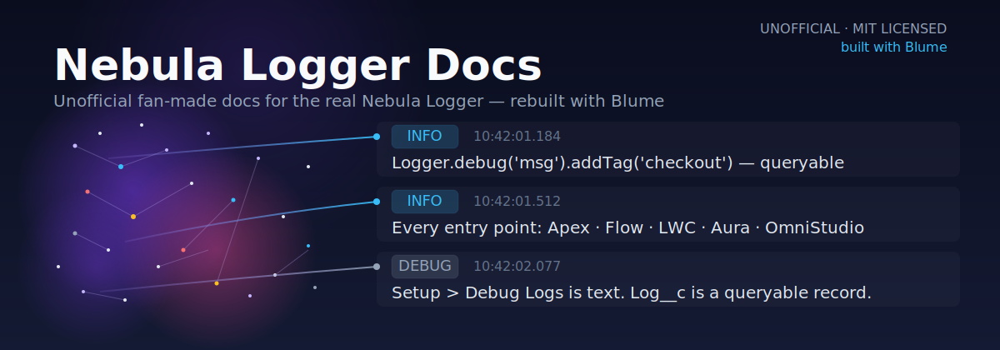

# Nebula Logger Docs — a Blume demo

<p align="center">
  
</p>

<p align="center">
  <a href="https://github.com/jongpie/NebulaLogger"></a>
  <a href="./ATTRIBUTION.md"></a>
  <a href="https://useblume.dev"></a>
</p>

A fan-made, unofficial docs site for [Nebula Logger](https://github.com/jongpie/NebulaLogger) — the open-source Salesforce observability framework — rebuilt from scratch with [Blume](https://useblume.dev), a zero-config, AI-ready documentation framework.

**Live demo:** https://shivanshsen7.github.io/blume-nebula-logger-docs/

## What's inside

39 pages across three tiers, all sourced from the real project — nothing written from a summary or from memory:

| Tier | Pages | What it covers |
| --- | ---: | --- |
| **Start here** (`docs/*.mdx`) | 6 | Persona-routed entry points: overview, for-developers, for-admins, for-architects, tagging-and-data, about-this-demo |
| **Guides** (`docs/guides/*.mdx`) | 26 | Every page from the real [Nebula Logger wiki](https://github.com/jongpie/NebulaLogger/wiki), adapted into Blume MDX: architecture, core features, the plugin framework, logging from Apex/LWC/Flow/OmniStudio, managing logs, the console app, data mask rules, permission sets, troubleshooting, and more |
| **Reference** (`docs/reference/*.mdx`) | 7 | An Apex API reference synthesized from the project's real ApexDocs output (Logger Engine, Log Management, Configuration, Plugins, Test Utilities), a Lightning Components reference, and a data model reference built from the actual custom object fields |

## How it was built

A 33-agent fan-out (mixed Sonnet/Haiku) cloned the real Nebula Logger source and wiki repos and adapted them page by page, one subagent per page.

Two upstream wiki pages — `Configuring-Global-Features` and `Logging-in-OpenTelemetry-REST-API` — turned out to be unwritten "TODO" stubs; even the maintainer hasn't gotten to them. Rather than inventing content to fill the gap, those pages carry over as honest placeholders that say so and link to related real content instead.

See [`ATTRIBUTION.md`](./ATTRIBUTION.md) for the full license and credit. **This is not the official Nebula Logger documentation** — for the real thing, go to [github.com/jongpie/NebulaLogger](https://github.com/jongpie/NebulaLogger).

**Note on images:** a handful of guide pages hotlink screenshots directly from the real wiki repo (`raw.githubusercontent.com/wiki/jongpie/NebulaLogger/...`) rather than bundling copies. The URLs return valid images via direct HTTP fetch, but haven't been confirmed yet in a live browser render — worth checking after your first deploy, and consider downloading them into the repo instead if you want to be independent of the upstream wiki.

## Running it yourself

```bash
npm install
npm run dev      # local dev server
npm run build    # static build to ./dist
npm run doctor   # health check
```

Requires Node.js 22.12+.

## Deploying your own fork

This copy is already live at the link above. To point a fork at your own GitHub Pages URL instead:

1. Push your fork to GitHub (public repo recommended).
2. In `blume.config.ts`, update the `deployment` block with your GitHub Pages URL:
   ```ts
   deployment: {
     site: "https://<your-username>.github.io/<repo-name>",
     base: "/<repo-name>",
   },
   ```
3. In the repo's **Settings → Pages**, set **Build and deployment → Source** to **GitHub Actions**.
4. Push to `main` — the included workflow at `.github/workflows/deploy.yml` builds and deploys automatically. First run may need to be triggered manually via the **Actions** tab (workflow_dispatch) if Pages wasn't enabled before the first push.

## Built with

- [Blume](https://useblume.dev) — zero-config, AI-ready documentation framework
- Content adapted from [Nebula Logger](https://github.com/jongpie/NebulaLogger) under MIT License
