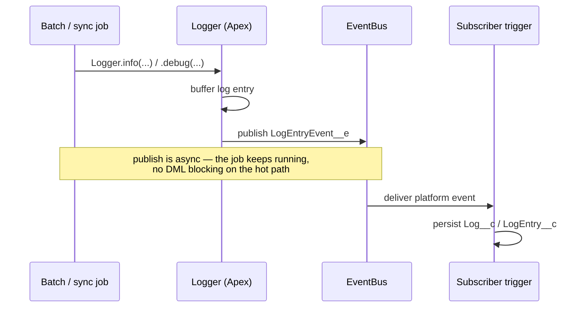

Nebula Logger is built 100% natively on the platform — no external dependencies, no middleware, no integration user to provision. That matters for architecture review boards: it's one more managed or unlocked package inside the org boundary, not a new system to threat-model.

## Event-driven core

Log entries are published as `LogEntryEvent__e` platform events using a publish/subscribe pattern. That decouples the *act of logging* from the *cost of logging* — a governor-limit-hungry batch job can fire hundreds of log entries without blocking on DML, and a subscriber trigger handles persistence independently.



## Data model

<CodeGroup>

```text Core objects
Log__c              — one per transaction/session
LogEntry__c          — one or more per Log__c, the actual log lines
LogEntryTag__c       — junction object for tagging
LoggerTag__c         — reusable tag definitions
LoggerScenario__c    — groups related logs by business scenario
```

```text Configuration (Custom Metadata)
LoggerSettings__c        — per-user / per-profile logging level thresholds
LoggerParameter__mdt     — global feature flags for complex orgs
LogEntryDataMaskRule__mdt — automatic masking of sensitive fields
LoggerFieldMapping__mdt  — maps custom fields onto Log__c / LogEntry__c
LoggerPlugin__mdt        — registers Apex or Flow plugins
LogStatus__mdt           — configurable log lifecycle statuses
```

</CodeGroup>

Because thresholds live in `LoggerSettings__c` hierarchy custom settings, you can run `FINEST`-level logging for a specific profile during an incident without touching a line of code or redeploying anything.

## Scalability and governance

- **Global feature flags** via `LoggerParameter__mdt` let you tune behavior per-org without a deployment
- **Automatic data masking** via `LogEntryDataMaskRule__mdt` keeps PII out of log entries by rule, not by developer discipline
- **Default 14-day retention**, purged via a batchable (`LogBatchPurger`) and its schedulable wrapper — configurable, not hardcoded
- **Plugin framework** (unlocked package only) lets you extend logging behavior via Apex (`LoggerPlugin.Triggerable`) or Flow, without forking the package

## Packaging choice: unlocked vs. managed

<CodeGroup>

```text Unlocked Package
Namespace: none
Release cycle: faster patches
Apex methods: public/protected, subject to change
Plugin framework: available
```

```text Managed Package
Namespace: Nebula
Release cycle: slower, more stable minor versions
Apex methods: global, contractually stable
Plugin framework: not available
```

</CodeGroup>

The trade-off is a familiar one for any managed-package decision: unlocked buys you speed and extensibility, managed buys you a stable public API contract. Most enterprise programs pick based on whether they intend to extend the plugin framework at all.

<Panel>
  This is exactly the kind of nuance that tends to live only in a wiki page or a Slack thread. Publishing it as a real, searchable page is the difference between "someone on the team knows this" and "the org knows this."
</Panel>
