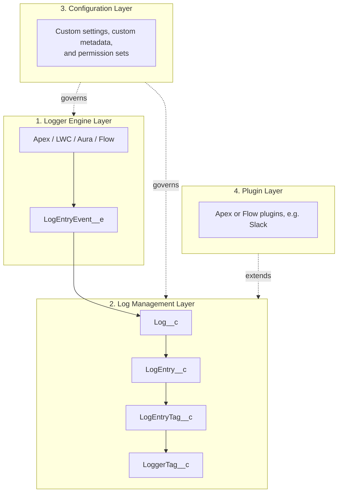

Nebula Logger is built natively on Salesforce - everything is built using Apex, Lightning components, and various types of objects.

All of the metadata is broken down into 4 layers/modules:

<Frame caption="Each layer builds on the one below it — the engine publishes events, log management persists them, configuration governs both, and plugins extend log management.">
  
</Frame>

<CardGroup cols={2}>
  <Card title="1. Logger Engine Layer" icon="cog">
    The core of Nebula Logger that makes logging work.
  </Card>
  <Card title="2. Log Management Layer" icon="database">
    View and manage logging data via the Logger Console app.
  </Card>
  <Card title="3. Configuration Layer" icon="sliders">
    Custom settings, metadata types, and permission sets.
  </Card>
  <Card title="4. Plugin Layer" icon="puzzle-piece">
    Add new functionality via plugins, such as Slack.
  </Card>
</CardGroup>

### How the layers connect

## 1. Logger Engine Layer

The core of Nebula Logger that makes logging work. Currently, logging is supported for:

- Apex
- Lightning web components & Aura components
- Flow, including a generic Flow log entry, a record-specific Flow log entry, and a collection-specific Flow log entry

This layer includes 1 platform event object:

- `LogEntryEvent__e` platform event

## 2. Log Management Layer

This provides the ability to view and manage logging data, using the Logger Console Lightning app. This layer includes 4 custom objects:

- `Log__c` custom object
- `LogEntry__c` custom object
- `LogEntryTag__c` custom object
- `LoggerTag__c` custom object

## 3. Configuration Layer

Admins, developers, and architects can control & customize Nebula Logger's built-in features, using custom settings, custom metadata types, and permission sets. This layer includes:

| Category | Item | Purpose |
| --- | --- | --- |
| Custom Hierarchy Settings | `LoggerSettings__c` | User-specific configurations |
| Custom Metadata Types | `LoggerParameter__mdt` | System-wide key-value pair configurations |
| Custom Metadata Types | `LogEntryDataMaskRule__mdt` | Configuring regex-based data masking rules |
| Custom Metadata Types | `LogStatus__mdt` | Configuring which picklist values in `Log__c.Status__c` map to `IsClosed__c` and `IsResolved__c` |
| Custom Metadata Types | `LogEntryTagRule__mdt` | Configuring tagging rules |
| Permission Sets | `LoggerAdmin` | |
| Permission Sets | `LoggerLogViewer` | |
| Permission Sets | `LoggerEndUser` | |
| Permission Sets | `LoggerLogCreator` | |

## 4. Plugin Layer

This layer provides the ability to add new functionality to Nebula Logger by creating or installing plugins. Currently, a plugin is available for Slack, and other plugins are in development.

<Panel>
Plugins can be built for any of the 5 included objects: `LogEntryEvent__e` platform event, `Log__c`, `LogEntry__c`, `LogEntryTag__c`, and `LoggerTag__c` custom objects.
</Panel>

---

*Adapted from the [Nebula Logger wiki](https://github.com/jongpie/NebulaLogger/wiki/Architecture), © Jonathan Gillespie and contributors, MIT License.*
