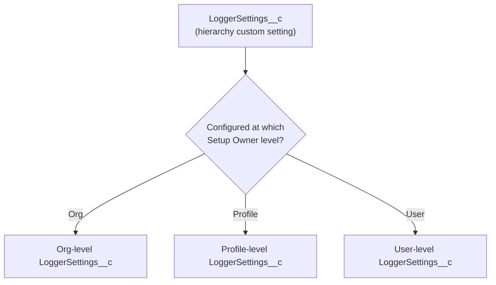

The hierarchy custom settings object `LoggerSettings__c` is used to control the behavior of several aspects of the logging system. It can be configured at the org, profile, and/or user levels, referred to as the "Setup Owner".

## Settings Reference

| Setting Field Name | Default Value | Description |
|---|---|---|
| **IsEnabled__c** | `true` | Determines if Logger runs for the specified Setup Owner |
| **LoggingLevel__c** | `DEBUG` | The name of the [Logging Level enum value](https://developer.salesforce.com/docs/atlas.en-us.apexref.meta/apexref/apex_methods_system_system.htm#system_logging_level_enum) to use for the specified Setup Owner. Only log entries that meet the specified logging level will be logged. Possible values: ERROR, WARN, INFO, DEBUG, FINE, FINER, FINEST |
| **DefaultSaveMethod__c** | `EVENT_BUS` | Controls the default save method used by Logger when calling `saveLog()`. Possible values: **EVENT_BUS** (default, uses EventBus to publish LogEntryEvent__e records), **QUEUEABLE** (asynchronous using a queueable job), **REST** (synchronous callout to org's REST API), **SYNCHRONOUS_DML** (immediately creates Log__c and LogEntry__c records—caution: exceptions will prevent log entries from being saved) |
| **ApplyDataMaskRules__c** | `true` | When enabled, any [configured data mask rules](./Configuring-Data-Mask-Rules) will run for the specified Setup Owner |
| **StripInaccessibleRecordFields__c** | `false` | When enabled, only fields that the specified Setup Owner can access will be included in SObject records' JSON. Useful in orgs where end-users have access to view Log__c and LogEntry__c records |
| **AnonymousMode__c** | `false` | When enabled, logs are stored anonymously—Log__c and LogEntry__c records will not contain user-identifying info. Works best with EVENT_BUS save method. Note: LogEntryEvent__e.CreatedById will still reflect the current user due to Salesforce platform limitations |
| **SystemLogMessageFormat__c** | `{OriginType__c}\n{Message__c}` | Configures the output of automatic `System.debug()` calls using Handlebars syntax to reference LogEntryEvent__e fields (e.g., `{OriginLocation__c}\n{Message__c}`) |
| **DefaultLogShareAccessLevel__c** | `Read` | Uses Apex managed sharing to grant users read or edit access to their log records on insert. Possible values: blank (null), Read, Edit. Users still need object-level access via permission sets or profiles |
| **DefaultNumberOfDaysToRetainLogs__c** | `14` | Sets the Log__c.LogRetentionDate__c field, used by the LogBatchPurger batch job to delete old logs. Set to blank (null) to keep logs indefinitely |
| **EnableSystemMessages__c** | `14` | When enabled, log entries may be generated with additional system details (e.g., LogBatchPurger creates entries showing how many records are being deleted) |

## Key Considerations

<Panel>
**Anonymous Mode Limitations**: Anonymous Mode is most effective with the EVENT_BUS save method. When using QUEUEABLE, REST, or SYNCHRONOUS_DML save methods, audit fields (CreatedById, LastModifiedById) will show the current user. Additionally, Salesforce automatically sets LogEntryEvent__e.CreatedById to the current user; only other user-related fields are set to null.
</Panel>

---

*Adapted from the [Nebula Logger wiki](https://github.com/jongpie/NebulaLogger/wiki/Configuring-User-Settings), © Jonathan Gillespie and contributors, MIT License.*
