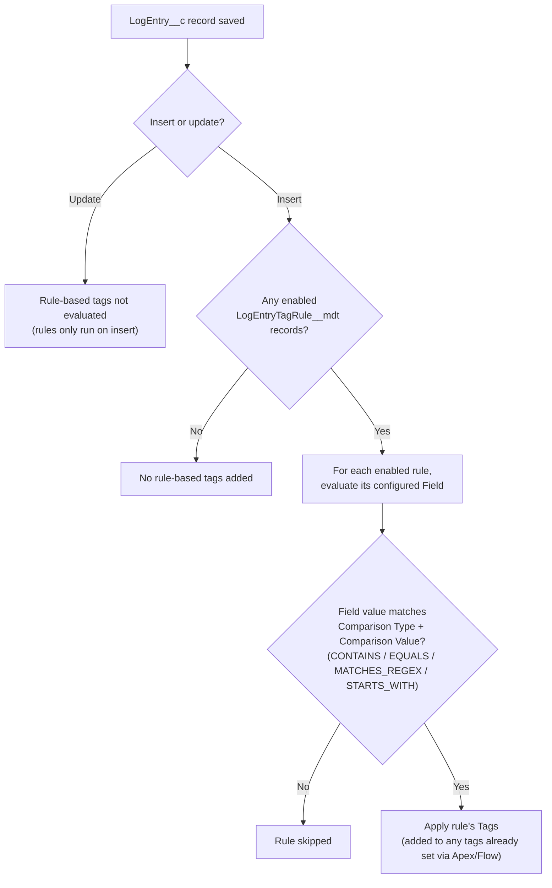
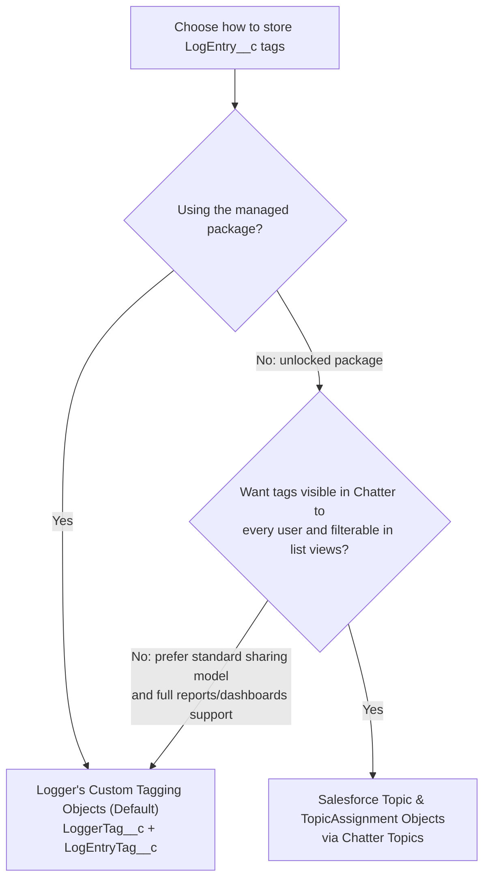

Nebula Logger supports dynamically tagging/labeling your `LogEntry__c` records via Apex, Flow, and custom metadata records in `LogEntryTagRule__mdt`. Tags can then be stored using one of two supported modes.

<Panel>
Two other topics in the upstream wiki page — Custom Field Mappings and Scenario-Based Logging — are marked as `TODO` upstream and have no documented content yet, so they're omitted here rather than guessed at.
</Panel>

## Tagging log entries

Apex developers can use 2 methods on `LogEntryBuilder` to add tags: `LogEntryEventBuilder.addTag(String)` and `LogEntryEventBuilder.addTags(List<String>)`.

<Tabs>
  <Tab title="Apex">

```apex
// Use addTag(String tagName) for adding 1 tag at a time
Logger.debug('my log message').addTag('some tag').addTag('another tag');

// Use addTags(List<String> tagNames) for adding a list of tags in 1 method call
List<String> myTags = new List<String>{'some tag', 'another tag'};
Logger.debug('my log message').addTags(myTags);
```

  </Tab>
  <Tab title="Flow">

Flow builders can use the `Tags` property to specify a comma-separated list of tags to apply to the log entry. This is available on all 3 Flow classes: `FlowLogEntry`, `FlowRecordLogEntry`, and `FlowCollectionLogEntry`.

  </Tab>
</Tabs>

### Adding tags with custom metadata rules

Admins can configure tagging rules that append additional tags automatically, using the custom metadata type `LogEntryTagRule__mdt`.



- Rule-based tags are only added when `LogEntry__c` records are created (not on update).
- Rule-based tags are added in addition to any tags already added via Apex and/or Flow.
- Each rule evaluates the value of a single field on `LogEntry__c` (e.g., `LogEntry__c.Message__c`).
- Each rule can only evaluate 1 field, but multiple rules can evaluate the same field.
- A single rule can apply multiple tags — put each tag on its own line in the `Tags` field (`LogEntryTagRule__mdt.Tags__c`).

Each rule record is configured with:

1. **Logger SObject** — currently only the "Log Entry" object (`LogEntry__c`) is supported.
2. **Field** — the field to evaluate, e.g. `LogEntry__c.Message__c`. Only 1 field per rule, but multiple rules can share a field.
3. **Comparison Type** — one of `CONTAINS`, `EQUALS`, `MATCHES_REGEX`, or `STARTS_WITH`.
4. **Comparison Value** — the value to compare the field against.
5. **Tags** — the list of tag names to apply to matching `LogEntry__c` records.
6. **Is Enabled** — only enabled rules run, making it easy to toggle a rule off without deleting it.

For example, a rule configured to match "My Important Text" in `Message__c` could automatically apply two tags to any matching `LogEntry__c` record — "Really important tag" and "A tag with an emoji, whynot?! 🔥".

## Choosing a tagging mode

Once tagging is set up in Apex or Flow, you choose how tags are stored in your org. You can also build your own plugin to leverage a custom tagging system (plugins aren't currently available in the managed package).



| | Logger's Custom Tagging Objects (Default) | Salesforce `Topic` and `TopicAssignment` Objects |
|---|---|---|
| **Summary** | Stores tags in custom objects `LoggerTag__c` and `LogEntryTag__c`. | Leverages Salesforce's [Chatter Topics functionality](https://www.salesforce.com/products/chatter/features/online-collaboration-tools) to store tags. Not available in the managed package. |
| **Data model** | `LoggerTag__c` represents the tag itself, unique on `LoggerTag__c.Name` (auto-created by the logging system if it doesn't exist). `LogEntryTag__c` is the junction object between `LoggerTag__c` and `LogEntry__c`. | `Topic` is a standard object used to tag any Salesforce record with Topics enabled — see the [object reference](https://developer.salesforce.com/docs/atlas.en-us.object_reference.meta/object_reference/sforce_api_objects_topic.htm). `TopicAssignment` is the junction object between a `Topic` and any supported SObject, via a polymorphic `EntityId` field — see the [object reference](https://developer.salesforce.com/docs/atlas.en-us.object_reference.meta/object_reference/sforce_api_objects_topicassignment.htm). |
| **Data visibility** | Access to `LoggerTag__c` is granted/restricted with standard object and record-sharing tools (OWD, sharing rules, profiles, permission sets). By default, `LoggerTag__c` OWD is "public read-only" for internal users and "private" for external users. Since `LogEntryTag__c` is a junction object, access depends on the user's access to the related `LogEntry__c` and `LoggerTag__c` records. | All `Topic` records are visible in Chatter to every user, including ones created by Logger — a benefit for some orgs, a concern for others. `TopicAssignment` records are only visible to users with access to the related `EntityId` (the `LogEntry__c` record). |
| **Leveraging data** | Since data lives in custom objects, you can use any platform functionality: custom list views, reports & dashboards, Chatter feeds, activities/tasks, and so on. | Topics can [filter list views](http://releasenotes.docs.salesforce.com/en-us/winter20/release-notes/rn_lex_lists_topic_filters.htm), which is useful, but using Topics [in reports and dashboards is only partially implemented](https://trailblazer.salesforce.com/ideaView?id=08730000000l12wAAA). |

---

*Adapted from the [Nebula Logger wiki](https://github.com/jongpie/NebulaLogger/wiki/Core-Features), © Jonathan Gillespie and contributors, MIT License.*
