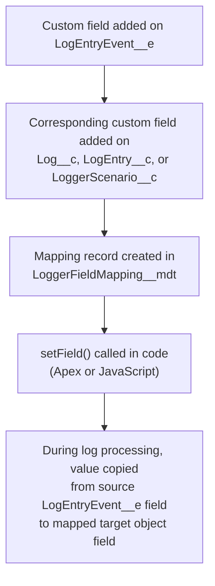

Since [v4.13.14](https://github.com/jongpie/NebulaLogger/releases/tag/v4.13.14), Nebula Logger provides the ability to add your own custom fields to its included custom objects. This is helpful in orgs that want to extend Nebula Logger's included data model by creating their own org-specific or project-specific fields.



## Getting Started

To start using custom field mappings, follow these four steps:

1. Add a custom field on `LogEntryEvent__e` (using any data type supported by platform events)
2. Add a corresponding custom field on either `Log__c` or `LogEntry__c`
3. Create a mapping record in `LoggerFieldMapping__mdt`
4. Set your custom fields in code when logging

<Panel>
**Current Limitations**

This functionality currently only works in Apex and JavaScript. Flows and OmniStudio cannot yet use this feature. See [Issue #719](https://github.com/jongpie/NebulaLogger/issues/719) for Flow support and [Issue #861](https://github.com/jongpie/NebulaLogger/issues/861) for OmniStudio support.
</Panel>

## Adding Custom Fields to LogEntryEvent__e

The first step is to add a custom field to the `LogEntryEvent__e` platform event. You can use any data type supported by platform events.

In this example, a custom text field called `SomeCustomField__c` is added to `LogEntryEvent__e`.

Once the field exists, you can populate it using one of two methods on `LogEntryEventBuilder`:

- `setField(Schema.SObjectField field, Object fieldValue)` — set a single field
- `setField(Map<Schema.SObjectField, Object> fieldToValue)` — set multiple fields at once

<CodeGroup>
```apex Single Field
Logger.info('hello, world')
    .setField(LogEntryEvent__e.SomeCustomTextField__c, 'some text value');
```

```apex Multiple Fields
Logger.info('hello, world')
    .setField(new Map<Schema.SObjectField, Object>{
        LogEntryEvent__e.AnotherCustomTextField__c => 'another text value',
        LogEntryEvent__e.SomeCustomDatetimeField__c => System.now()
    });
```
</CodeGroup>

## Adding Custom Fields to Nebula Objects

To persist custom field values in Nebula Logger's custom objects, create corresponding fields on one of these supported objects:

- `Log__c`
- `LogEntry__c`
- `LoggerScenario__c`

Once you've added the custom field to both `LogEntryEvent__e` and your target object (using the same field name), create a mapping record in the `LoggerFieldMapping__mdt` custom metadata type. Nebula Logger will automatically populate the target object's field with the value from the source `LogEntryEvent__e` field during log processing.

## Setting Custom Fields in Code

Both platforms call a `setField()` method to populate custom fields — the instance methods on `LogEntryEventBuilder` in Apex, or the function in `logEntryBuilder.js` in Lightning components.

<Tabs>
<Tab title="Apex">

```apex
Logger.info('hello, world')
    // Set a single field
    .setField(LogEntryEvent__e.SomeCustomTextField__c, 'some text value')
    // Set multiple fields
    .setField(new Map<Schema.SObjectField, Object>{
        LogEntryEvent__e.AnotherCustomTextField__c => 'another text value',
        LogEntryEvent__e.SomeCustomDatetimeField__c => System.now()
    });
```
</Tab>

<Tab title="JavaScript">

```javascript
import { createLogger } from "c/logger";

export default class LoggerCustomFieldDemo extends LightningElement {
  logger;

  async connectedCallback() {
    this.logger = await createLogger();

    this.logger.info("Hello, world! This log entry has 2 custom fields set.")
      .setField({
        SomeCustomTextField__c: "some text value",
        SomeCustomNumberField__c: 123,
      });

    this.logger.debug("Hello again, world! This log entry has 1 other custom field set.")
      .setField({
        AnotherCustomTextField__c: "another text value",
      });

    this.logger.saveLog();
  }
}
```
</Tab>
</Tabs>

---

*Adapted from the [Nebula Logger wiki](https://github.com/jongpie/NebulaLogger/wiki/%5BWIP%5D--Custom-Field-Mappings), © Jonathan Gillespie and contributors, MIT License.*
