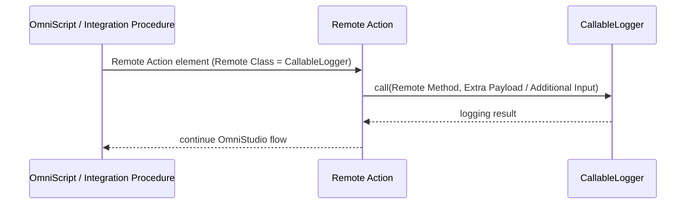

## Overview

Starting with Nebula Logger v4.14.10, you can provide logging capabilities in OmniStudio by leveraging the included `CallableLogger` Apex class as a remote action. This allows you to add log entries, save logs, and interact with other Nebula Logger functionality directly within your OmniStudio configurations.

The `CallableLogger` class can be configured as a remote action in:
- OmniScript metadata
- OmniIntegrationProcedure metadata

Depending on which action you call, some additional inputs may be required. For details on available actions and their required inputs, see [the list of available actions](./Dynamically-Call-Nebula-Logger#available-actions) in the `CallableLogger` Apex class documentation.

## Logging in OmniScripts

To add logging to an OmniScript:

1. Find and add a **Remote Action** element to your OmniScript configuration
2. Configure the remote action with the following:
   - **Remote Class**: `CallableLogger`
   - **Remote Method**: The name of the action you want to call (see available actions documentation)
   - **Extra Payload**: Any additional inputs required for the specified action (not all actions require extra payload)

## Logging in Integration Procedures

To add logging to an OmniIntegrationProcedure:

1. Find and add a **Remote Action** to your Integration Procedure
2. Configure the remote action with:
   - **Remote Class**: `CallableLogger`
   - **Remote Method**: The name of the action you want to call
   - **Additional Input**: Any additional inputs required for the specified action (optional, depending on the action)

Both OmniScripts and Integration Procedures use the same `CallableLogger` class and support the same actions—the configuration approach is consistent across both OmniStudio features.

---

*Adapted from the [Nebula Logger wiki](https://github.com/jongpie/NebulaLogger/wiki/Logging-in-OmniStudio), © Jonathan Gillespie and contributors, MIT License.*
