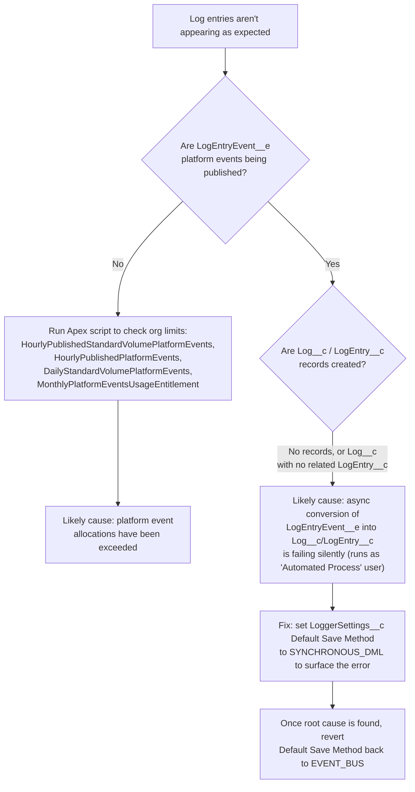

Occasionally, issues can come up that prevent Logger from successfully saving log entries — this could occur due to bugs within Nebula Logger, or due to configuration issues within your org. Regardless of the root cause, here are some useful steps in trying to debug and resolve the issues.



## LogEntryEvent__e Platform Events Are Not Published

Logger uses a [platform event](https://developer.salesforce.com/docs/atlas.en-us.232.0.platform_events.meta/platform_events/platform_events_intro.htm) object called `LogEntryEvent__e` to handle creating log entries. Just like other features within Salesforce, platform events have some limits, including daily limits on how many platform events can be created/published. If your org is no longer publishing `LogEntryEvent__e` records, you may have exceeded one or more of [the platform events allocations](https://developer.salesforce.com/docs/atlas.en-us.232.0.platform_events.meta/platform_events/platform_event_limits.htm).

To check your org's usage and limits of platform events, run this Apex script in your org.

```apex
List<String> platformEventLimitNames = new List<String>{
    'HourlyPublishedStandardVolumePlatformEvents',
    'HourlyPublishedPlatformEvents',
    'DailyStandardVolumePlatformEvents',
    'MonthlyPlatformEventsUsageEntitlement'
};
for (String platformEventLimitName : platformEventLimitNames) {
    OrgLimit orgPlatformEventLimit =  OrgLimits.getMap().get(platformEventLimitName);
    System.debug('Org Limit ' + orgPlatformEventLimit.getName() + ': Used ' + orgPlatformEventLimit.getValue() + ' out of ' + orgPlatformEventLimit.getLimit());
}
```

## Log__c or LogEntry__c Records Are Not Created

In some situations, you may notice that no errors occur for you (or your org's users), but you do not see some of the expected logging data. This can result in one of two scenarios:

- No `Log__c` or `LogEntry__c` records are created
- The `Log__c` record is created, but it does not have any related `LogEntry__c` records

In nearly every previous scenario where these issues have happened, it occurs because of an issue with converting `LogEntryEvent__e` platform events into the `Log__c` and `LogEntry__c` records. This process happens asynchronously (running under the 'Automated Process' user), which can hide the fact that an error is occurring.

<Panel>
To help surface these errors, change your `LoggerSettings__c` record to use `SYNCHRONOUS_DML` as the Default Save Method (instead of `EVENT_BUS`, `QUEUEABLE`, or `REST`). Using this save method skips the creation/publishing of `LogEntryEvent__e`, and instead immediately tries to create the `Log__c` and `LogEntry__c` records — this surfaces any errors during the transaction, making it easier to determine the root cause. In most situations, you'll want to revert back to using `EVENT_BUS` as the default save method once you've determined the root cause issue.
</Panel>

---

*Adapted from the [Nebula Logger wiki](https://github.com/jongpie/NebulaLogger/wiki/Logging-Troubleshooting), © Jonathan Gillespie and contributors, MIT License.*
