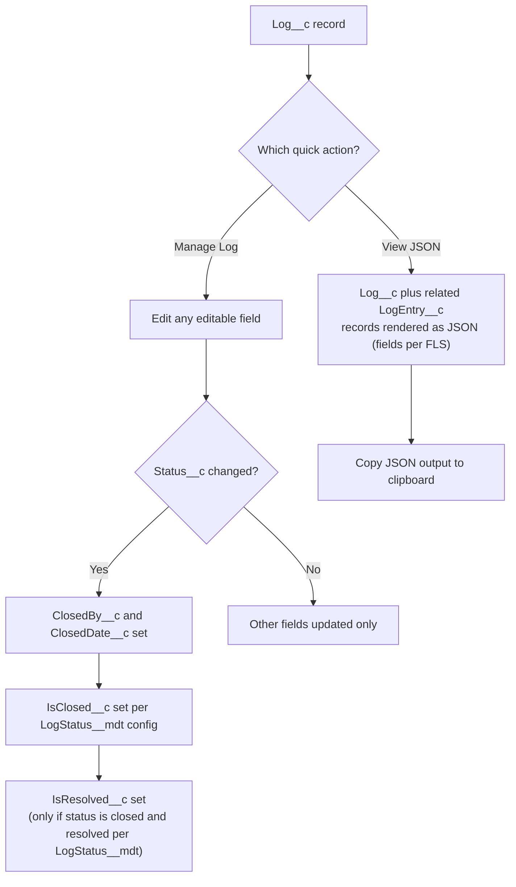

## Overview

To help development and support teams better manage logs and address underlying code or config issues, Nebula Logger provides several fields on `Log__c` to track ownership, priority, and status. While these fields are optional, they're essential in critical environments (production, QA sandboxes, UAT sandboxes, etc.) for monitoring ongoing user activities.

## Manage Quick Action

All editable fields on `Log__c` can be updated via the **Manage Log** quick action. When you modify `Log__c.Status__c`, several fields are automatically set:

- **`Log__c.ClosedBy__c`** — The user who closed the log
- **`Log__c.ClosedDate__c`** — The datetime the log was closed
- **`Log__c.IsClosed__c`** — Indicates if the log is closed, based on the selected status and the 'Log Status' custom metadata type configuration
- **`Log__c.IsResolved__c`** — Indicates if the log is resolved (meaning it required analysis/work that has been completed). Only closed statuses can be considered resolved, as configured in the 'Log Status' custom metadata type

### Customizing Status Values

Out-of-the-box, Nebula Logger provides default picklist values for `Log__c.Status__c`. To customize the available statuses, update the picklist values for this field and create or update corresponding records in the **LogStatus__mdt** custom metadata type. This custom metadata type controls which statuses are considered closed and resolved.

## View JSON Quick Action

The **View JSON** quick action makes it easy to inspect a `Log__c` record in JSON format. It displays the current `Log__c` record plus all related `LogEntry__c` records as JSON, with a handy button to copy the output to your clipboard. All fields the current user can view (based on field-level security) are dynamically included, including any custom fields added to your org or by plugins.

---

*Adapted from the [Nebula Logger wiki](https://github.com/jongpie/NebulaLogger/wiki/Managing-Logs), © Jonathan Gillespie and contributors, MIT License.*
