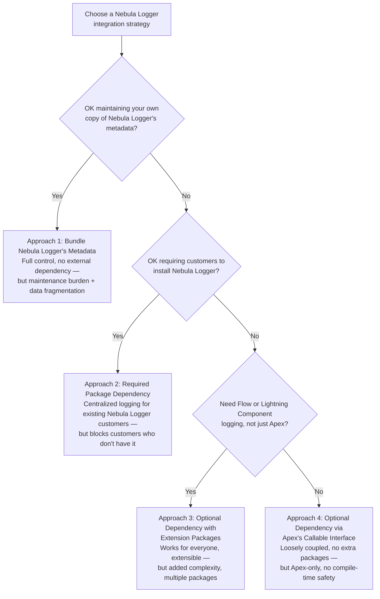

If you're building a Salesforce package (1GP or 2GP) and want to provide logging capabilities, there's no one-size-fits-all approach. Nebula Logger supports four distinct integration strategies, each with its own tradeoffs for maintainability, customer experience, and flexibility.

## Approach 1: Bundle Nebula Logger's Metadata

Include all of Nebula Logger's open-source metadata directly in your package. You maintain your own copy and have full control over customization.

**Advantages:**
- Complete control — customize Nebula Logger's metadata as needed for your package's specific requirements
- No external dependencies — your package works independently

**Disadvantages:**
- Maintenance burden — you must add and maintain a copy of Nebula Logger within your package
- Data fragmentation — if a customer already has Nebula Logger installed, logs split across two separate installations: customer logs stay in their Nebula Logger, package logs go to your bundled copy

## Approach 2: Required Package Dependency

Add a required dependency on one of Nebula Logger's packages (typically the managed package for its namespace support). Customers must install Nebula Logger to use your package.

**Advantages:**
- Ideal for customers who already use Nebula Logger — centralized logging in their existing instance

**Disadvantages:**
- Installation barrier — customers without Nebula Logger cannot install your package
- Reduces addressable market for your package

## Approach 3: Optional Dependency with Extension Packages

Use optional dependencies combined with extension packages and dynamic Apex code. Your core package has no hard dependency, but customers can install optional extension packages to enable Nebula Logger integration.

**Advantages:**
- Flexible — easily swap logging implementations based on what's available in the customer's org
- Works for everyone — customers can install your core package regardless of whether Nebula Logger is present
- Extensible — supports alternate logging tools via additional extension packages

**Disadvantages:**
- Added complexity — requires extension package development and additional metadata
- Multiple packages to manage — customers may need to install multiple packages for full functionality

**Real-world example:** [Apex Rollup](https://github.com/jamessimone/apex-rollup) uses this pattern:
- Its core unlocked package has [no dependencies](https://github.com/jamessimone/apex-rollup/blob/v1.5.30/sfdx-project.json#L3-L14) and works standalone
- It includes [its own `RollupLogger` class](https://github.com/jamessimone/apex-rollup/blob/v1.5.30/rollup/core/classes/RollupLogger.cls) with an [`ILogger` interface](https://github.com/jamessimone/apex-rollup/blob/v1.5.30/rollup/core/classes/RollupLogger.cls#L24-L28), enabling dependency injection for custom loggers
- When Nebula Logger is available, customers can install Apex Rollup's [optional Nebula Logger plugin package](https://github.com/jamessimone/apex-rollup/tree/v1.5.30/plugins/NebulaLogger)
- The plugin package depends on both Apex Rollup and Nebula Logger (managed or unlocked versions both supported)

## Approach 4: Optional Dependency via Apex's `Callable` Interface

Use loosely coupled integration through Apex's `Callable` interface. Your package has no dependency on Nebula Logger, but can invoke it dynamically when available.

**Advantages:**
- Truly loosely coupled — no direct dependencies required
- Works for everyone — customers can install your package with or without Nebula Logger
- No extension packages needed — no additional artifacts to manage
- Graceful degradation — leverages Nebula Logger when present, but doesn't require it

**Disadvantages:**
- Apex-only — only supports Apex logging; no dynamic logging in Flow or Lightning Components
- Error-prone — relies on `String` and generic `Object` values, offering no compile-time safety or IDE support

---

*Adapted from the [Nebula Logger wiki](https://github.com/jongpie/NebulaLogger/wiki/Package-Dependencies-Overview), © Jonathan Gillespie and contributors, MIT License.*
