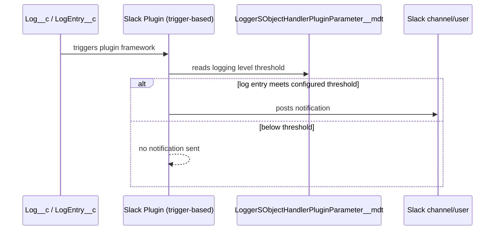

The optional [Slack plugin (beta)](https://github.com/jongpie/NebulaLogger/tree/main/nebula-logger/plugins/slack) leverages the Nebula Logger plugin framework to automatically send Slack notifications for logs that meet a configurable logging level threshold. Beyond its practical utility, the plugin serves as a fully-functioning example of how to build your own plugins for Nebula Logger.

## What It Does

When enabled and configured, the Slack plugin monitors your logs and automatically posts notifications to a configured Slack channel or user whenever a log entry reaches your specified logging level. This allows you to stay informed of critical issues without manually reviewing the Logger console.

## What You'll Learn

The Slack plugin demonstrates several key patterns for extending Nebula Logger:

- **Apply custom Apex logic** to `Log__c` and `LogEntry__c` records within the plugin framework
- **Add custom fields and list views** to Logger's objects to support your plugin's functionality
- **Extend permission sets** to include field-level security for your custom fields, ensuring proper access control
- **Leverage the `LoggerSObjectHandlerPluginParameter__mdt` metadata type** to store and manage plugin configuration, making your plugins configurable without code changes

## Getting Started

To install and customize the Slack plugin for your environment:

1. Review the [Slack plugin repository](https://github.com/jongpie/NebulaLogger/tree/main/nebula-logger/plugins/slack) for installation instructions and customization options
2. Deploy the plugin to your Salesforce org
3. Configure the logging level threshold and Slack webhook/connection details in the plugin's custom metadata records
4. Test by creating logs at your configured level and verifying Slack notifications arrive as expected

<Panel>
The Slack plugin is in beta and serves dual purposes: providing a practical notification integration while teaching plugin architecture patterns. As you build your own plugins, refer back to its implementation for best practices around metadata configuration, field security, and trigger-based automation.
</Panel>

---

*Adapted from the [Nebula Logger wiki](https://github.com/jongpie/NebulaLogger/wiki/Slack-Plugin), © Jonathan Gillespie and contributors, MIT License.*
