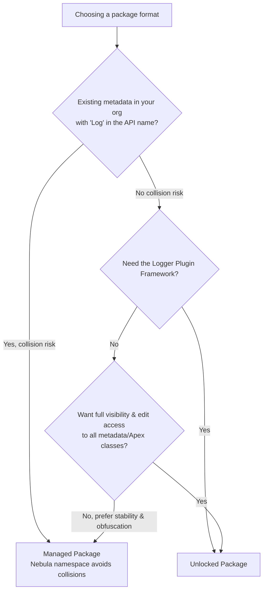

Nebula Logger is available as both a [2GP unlocked package](https://developer.salesforce.com/docs/atlas.en-us.sfdx_dev.meta/sfdx_dev/sfdx_dev_unlocked_pkg_intro.htm) and a [2GP managed package](https://developer.salesforce.com/docs/atlas.en-us.pkg2_dev.meta/pkg2_dev/sfdx_dev_dev2gp.htm). The metadata is the same in both packages, but there are some differences in the available functionality & features. All examples in the documentation are for the unlocked package (no namespace) - simply add the `Nebula` namespace to the examples if you are using the managed package.

<Panel>
In general, the unlocked package is typically recommended - but both options have their pros & cons. For many teams, using the managed package is the better choice - selecting the right choice for your team will depend on things like your org's existing metadata, how much control you want over Nebula Logger's metadata, and if certain features are critical for your team.
</Panel>

## Comparison

| | Unlocked Package (Recommended) | Managed Package |
| --- | --- | --- |
| **Namespace** | None/no namespace - note that because there is no namespace, if you already have existing metadata in your org with the same API name as any of Nebula Logger's metadata, the package installation will fail / you won't be able to use the unlocked package. All of Nebula Logger's metadata contains the word `Log` in it somewhere (e.g., `Logger` and `FlowLogEntry` Apex classes, `Log__c` and `LogEntry__c` objects, etc.). If you do **not** have any of your own metadata with `Log` in the name, then you should be able to install the unlocked package in your org. | `Nebula` - Apex references will include the namespace like `Nebula.Logger.saveLog()`, along with object & field names like `Nebula__Log__c.Nebula__TransactionId__c`, etc. You should never encounter naming collision issues with Nebula Logger's metadata. |
| **Future Releases** | Faster release cycle: new patch versions are released (e.g., `v4.4.x`) for new enhancements & bugfixes that are merged to the `main` branch in GitHub | Slower release cycle: the managed package only receives new minor versions (e.g., v4.x). It now follows Salesforce's release cycle - it will have 3 planned releases/year (Spring, Summer, and Winter releases). You can reference [the list of milestones](https://github.com/jongpie/NebulaLogger/milestones) to see what's planned for each release. |
| **Viewing & Editing Metadata** | All of Nebula Logger's metadata is fully viewable & editable for system admins - unlocked packages without a namespace allow you to see everything & make any changes you'd like to make to the included metadata/code. | Some metadata is hidden, obfuscated, or set to read-only - Salesforce automatically does this to certain metadata in any/every managed package. For example, you cannot see or edit any of the Apex classes included in Nebula Logger's managed package. For some teams, this is not a concern - for other teams that either want more control, or have audit requirements for all code running in their org, this behavior can be a reason to choose the unlocked package instead. |
| **Public & Protected Apex Methods** | Any `public` and `protected` Apex methods are subject to change in the future - they can be used, but you may encounter deployment issues if future changes to `public` and `protected` methods are not backwards-compatible | Only `global` methods are available in managed packages - any `global` Apex methods available in the managed package will be supported for the foreseeable future |
| **Apex Debug Statements** | `System.debug()` is automatically called - the output can be configured with `LoggerSettings__c.SystemLogMessageFormat__c` to use any field on `LogEntryEvent__e` | Requires adding your own calls for `System.debug()` due to Salesforce limitations with managed packages |
| **Logger Plugin Framework** | Leverage Apex or Flow to build your own "plugins" for Logger - easily add your own automation to any of the included objects: `LogEntryEvent__e`, `Log__c`, `LogEntry__c`, `LogEntryTag__c` and `LoggerTag__c`. The logger system will then automatically run your plugins for each trigger event (BEFORE_INSERT, BEFORE_UPDATE, AFTER_INSERT, AFTER_UPDATE, and so on). | This functionality is not currently available in the managed package, but it's on the roadmap - see [issue #704](https://github.com/jongpie/NebulaLogger/issues/704) for more details. |

---

*Adapted from the [Nebula Logger wiki](https://github.com/jongpie/NebulaLogger/wiki/Unlocked-vs-Managed-Package), © Jonathan Gillespie and contributors, MIT License.*
