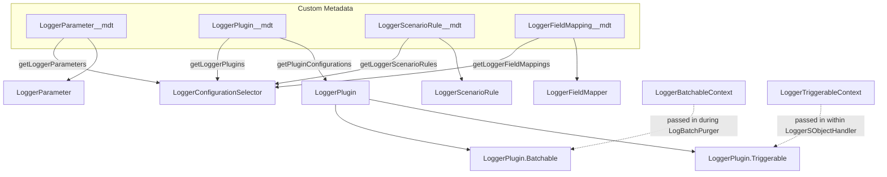

The Configuration module contains the Apex classes that read Nebula Logger's custom metadata types (org defaults, plugins, scenario rules, field mappings) and expose them to the rest of the framework, along with supporting caching and context objects used by the plugin and trigger-handler systems.

## LoggerParameter

Provides a centralized way to load configuration parameters for SObject handlers and plugins, casting the underlying `LoggerParameter__mdt` custom metadata values to common Apex data types. It also exposes a large set of static properties representing Nebula Logger's own built-in configuration switches (e.g., whether to query user/org/network data, enable tagging, use Platform Cache, etc.), each backed by a specific `LoggerParameter` custom metadata record and a documented default.

| Method | Description |
| --- | --- |
| `getBoolean(String parameterDeveloperName, Boolean defaultValue)` → `Boolean` | Returns the parameter's value as a `Boolean`, or `defaultValue` if unset |
| `getString(String parameterDeveloperName, String defaultValue)` → `String` | Returns the parameter's value as a `String`, or `defaultValue` if empty |
| `getInteger` / `getLong` / `getDouble` / `getDecimal` | Numeric-typed getters, each with a `parameterDeveloperName` and `defaultValue` |
| `getDate` / `getDatetime` | Date/time-typed getters, each with a `parameterDeveloperName` and `defaultValue` |
| `getId` / `getSObject` | `Id`- and `SObject`-typed getters, each with a `parameterDeveloperName` and `defaultValue` |
| `getBooleanList` / `getStringList` / `getIntegerList` / etc. | `List<T>` variants of the above getters for each supported type |
| `matchOnPrefix(String developerNamePrefix)` → `List<LoggerParameter__mdt>` | Returns all `LoggerParameter__mdt` records whose `DeveloperName` starts with the given prefix |

Key built-in static properties include `ENABLE_SYSTEM_MESSAGES`, `ENABLE_TAGGING`, `ENABLE_STACK_TRACE_PARSING`, `REQUIRE_SCENARIO_USAGE`, `USE_PLATFORM_CACHE`, `NORMALIZE_TAG_DATA`, `NORMALIZE_SCENARIO_DATA`, `LOG_BATCH_PURGER_DEFAULT_BATCH_SIZE`, and a family of `QUERY_*_DATA` / `QUERY_*_DATA_SYNCHRONOUSLY` flags controlling which contextual Salesforce data (user, organization, network, auth session, Apex class/trigger, flow definition view, OmniProcess, related record) Nebula Logger queries and whether it does so synchronously or asynchronously.

## LoggerConfigurationSelector

Selector class used for all SOQL queries specific to the configuration layer. It exposes a singleton instance and read methods for each configuration-related custom metadata type.

| Method | Description |
| --- | --- |
| `getInstance()` → `LoggerConfigurationSelector` | Returns the singleton selector instance |
| `getLoggerParameters()` → `Map<String, LoggerParameter__mdt>` | Returns the org's `LoggerParameter__mdt` records |
| `getLoggerPlugins()` → `List<LoggerPlugin__mdt>` | Returns the org's `LoggerPlugin__mdt` records |
| `getLoggerScenarioRules()` → `List<LoggerScenarioRule__mdt>` | Returns the org's `LoggerScenarioRule__mdt` records |
| `getLoggerFieldMappings()` → `List<LoggerFieldMapping__mdt>` | Returns the enabled `LoggerFieldMapping__mdt` records |
| `getLoggerSObjectHandlers()` → `List<LoggerSObjectHandler__mdt>` | Returns the org's `LoggerSObjectHandler__mdt` records |
| `getLogEntryDataMaskRules()` → `List<LogEntryDataMaskRule__mdt>` | Returns the org's `LogEntryDataMaskRule__mdt` records |
| `getLogEntryTagRules()` → `List<LogEntryTagRule__mdt>` | Returns enabled `LogEntryTagRule__mdt` records, with `SObjectField__c` resolved from `SObjectField__r.QualifiedApiName` |
| `getLogStatuses()` → `List<LogStatus__mdt>` | Returns the org's `LogStatus__mdt` records |

## LoggerPlugin

The core of the plugin framework, used to create custom Apex and Flow plugins for `LoggerSObjectHandler` and `LogBatchPurger` based on configuration stored in the `LoggerPlugin__mdt` custom metadata type.

| Method | Description |
| --- | --- |
| `getPluginConfigurations()` → `List<LoggerPlugin__mdt>` | Returns all enabled `LoggerPlugin__mdt` records |
| `getFilteredPluginConfigurations(List<Schema.SObjectField> populatedFilterFields, Schema.SObjectField sortByField)` → `List<LoggerPlugin__mdt>` | Returns configurations that have a value for at least one of the given filter fields, sorted by `sortByField` (with `DeveloperName` as a tiebreaker) |
| `newBatchableInstance(String apexClassTypeName)` → `Batchable` | Dynamically instantiates a class implementing `LoggerPlugin.Batchable` |
| `newTriggerableInstance(String apexClassTypeName)` → `Triggerable` | Dynamically instantiates a class implementing `LoggerPlugin.Triggerable` |
| `sortBy(Schema.SObjectField field)` → `PluginConfigurationSorter` | Returns a sorter for ordering plugin configurations by a given field |

It defines two inner interfaces that plugin authors implement: **`LoggerPlugin.Batchable`** (`start`, `execute`, `finish`, each taking a `LoggerPlugin__mdt` configuration and a `LoggerBatchableContext`) for hooking into the `LogBatchPurger` batch job, and **`LoggerPlugin.Triggerable`** (`execute(LoggerPlugin__mdt configuration, LoggerTriggerableContext input)`) for hooking into the `LoggerSObjectHandler` trigger framework.

## LoggerScenarioRule

Provides a centralized way to load scenario rules that override Nebula Logger's behavior for a given logging "scenario."

| Method | Description |
| --- | --- |
| `getAll()` → `Map<String, LoggerScenarioRule__mdt>` | Returns the current transaction's cached map of enabled scenario rules with valid `StartTime__c`/`EndTime__c` values, keyed by scenario |
| `getInstance(String scenario)` → `LoggerScenarioRule__mdt` | Returns the rule matching the given scenario name (via `Scenario__c`), or `null` if none is found |

## LoggerFieldMapper

Maps field values from custom fields on `LogEntryEvent__e` to the equivalent fields on `Log__c`, `LogEntry__c`, and `LoggerScenario__c`.

- `mapFieldValues(SObject sourceRecord, SObject targetRecord)` → `void` — copies field values from `sourceRecord` to `targetRecord` according to the rules configured in `LoggerFieldMapping__mdt`.

## LoggerCache

Caches query results and other data used elsewhere in Nebula Logger, backed by three interchangeable cache "layers" that all implement the same inner `Cacheable` interface: an organization-level cache, a session-level cache, and a transaction-level (in-memory) cache. When Platform Cache is disabled or unavailable, the organization and session caches fall back to the transaction cache.

| Method | Description |
| --- | --- |
| `getOrganizationCache()` → `Cacheable` | Singleton cache for organization-specific data via Platform Cache (falls back to transaction cache) |
| `getSessionCache()` → `Cacheable` | Singleton cache for session-specific data via Platform Cache (falls back to transaction cache) |
| `getTransactionCache()` → `Cacheable` | Singleton in-memory cache scoped to the current transaction |
| `isAvailable()` → `Boolean` | Indicates whether Platform Cache is available in the org |
| `contains(String key)` / `get(String key)` / `put(...)` / `remove(String key)` | Convenience pass-through methods mirroring `Cacheable`'s API on the default cache |

The inner **`LoggerCache.Cacheable`** interface defines the actual cache contract implemented by each layer: `contains(String key)` → `Boolean`, `get(String key)` → `Object`, `put(String key, Object value)` → `void`, and `remove(String key)` → `void`.

## LoggerBatchableContext

A simple data-holder class used by the logging system to pass batch contextual details into `LoggerPlugin.Batchable` plugins during `LogBatchPurger` execution.

- Constructor: `LoggerBatchableContext(Database.BatchableContext batchableContext, Schema.SObjectType sobjectType)`
- Properties: `batchableContext` → `Database.BatchableContext`, `sobjectType` → `Schema.SObjectType`, `sobjectTypeName` → `String`

## LoggerTriggerableContext

A data-holder class used by the logging system to pass trigger contextual details into `LoggerPlugin.Triggerable` plugins within `LoggerSObjectHandler`.

- Constructors: `LoggerTriggerableContext(Schema.SObjectType sobjectType, System.TriggerOperation triggerOperationType, List<SObject> triggerNew)` and an overload additionally accepting `triggerNewMap` and `triggerOldMap`.
- Properties: `sobjectType`, `sobjectTypeName`, `triggerNew`, `triggerNewMap`, `triggerOldMap`, `triggerOperationType`, `triggerOperationTypeName`, and `triggerRecords` (a `List<RecordInput>`).
- Inner class **`LoggerTriggerableContext.RecordInput`** exposes `triggerRecordNew` and `triggerRecordOld` (`SObject` properties) for surfacing per-record before/after data to Flow-based plugins.

---

*Generated from the real Nebula Logger Apex reference docs (ApexDocs output), © Jonathan Gillespie and contributors, MIT License. See the [full class reference on GitHub](https://github.com/jongpie/NebulaLogger/tree/main/docs/apex/Configuration) for exhaustive detail.*
