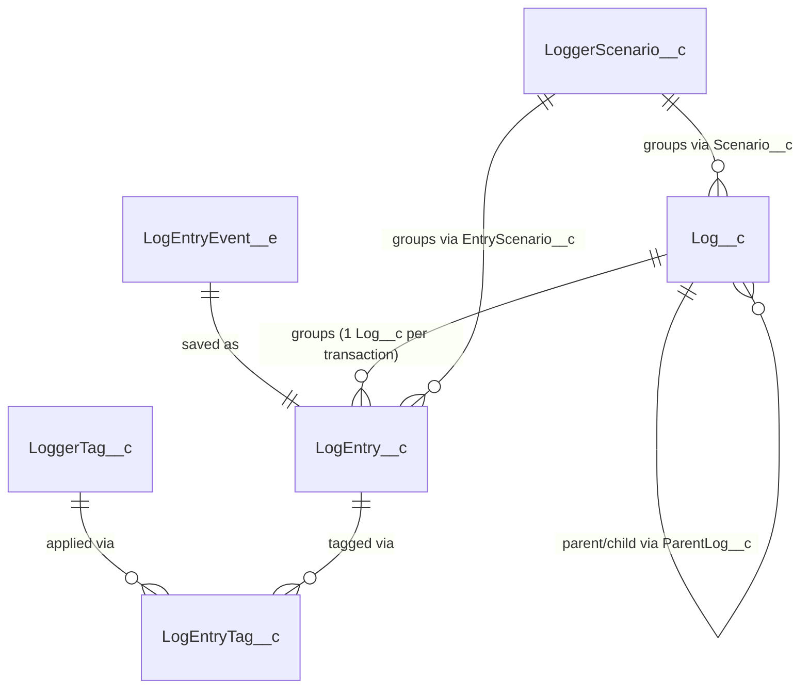

Nebula Logger's schema is spread across four architectural layers described in the project wiki. The **Logger Engine** layer publishes a single platform event, `LogEntryEvent__e`, every time application code calls the logger — this decouples the act of logging from the act of saving, so a log entry can be captured even if the surrounding transaction later fails or rolls back. The **Log Management** layer is responsible for turning those events into durable records: each `LogEntryEvent__e` is saved as a `LogEntry__c` record, and related entries are grouped under a single parent `Log__c` record (one `Log__c` per transaction, keyed on a shared transaction ID). Tagging is modeled as a many-to-many relationship: `LoggerTag__c` holds the reusable tag values, and the `LogEntryTag__c` junction object links individual `LogEntry__c` records to those tags. The **Configuration** layer's `LoggerSettings__c` is a hierarchy custom setting, so it can be defaulted at the org level and overridden per-profile or per-user to control things like whether logging is enabled, which logging level is captured, and how long logs are retained. A fourth object referenced here, `LoggerScenario__c`, backs the "scenario" feature that lets logs and entries be grouped and filtered by a named business process rather than only by transaction. A **Plugin** layer (not covered on this page) can extend behavior on any of these five objects.

`LoggerSettings__c` isn't shown above — it's a hierarchy custom setting that configures the pipeline (org, profile, or user level), not a record these objects link to by foreign key.

The sections below group a curated subset of each object's real field names (verified against the object metadata) into naming-pattern categories. Field purposes are inferred from their names and the wiki text — where the inference is a guess rather than a documented fact, this page says so plainly.

## Log__c

One `Log__c` record per logged transaction; acts as the parent/summary record for all of the `LogEntry__c` records created during that transaction.

**Transaction & Apex async context** (infers from naming convention)
- `TransactionId__c`
- `ParentLogTransactionId__c`
- `ParentLog__c`
- `ParentLogLink__c`
- `ParentSessionId__c`
- `AsyncContextType__c`
- `AsyncContextParentJobId__c`
- `AsyncContextChildJobId__c`
- `AsyncContextTriggerId__c`

**User & org context**
- `LoggedBy__c`
- `LoggedByUsername__c`
- `LoggedByUsernameLink__c`
- `LoggedByFederationIdentifier__c`
- `ImpersonatedBy__c`
- `ImpersonatedByUsernameLink__c`
- `OrganizationId__c`
- `OrganizationName__c`
- `OrganizationType__c`
- `ProfileId__c`
- `ProfileName__c`
- `UserRoleName__c`
- `UserType__c`

**Login / session context** (infers from naming convention — likely sourced from `LoginHistory` and session APIs)
- `LoginType__c`
- `LoginApplication__c`
- `LoginBrowser__c`
- `LoginPlatform__c`
- `SessionId__c`
- `SessionType__c`
- `SessionSecurityLevel__c`
- `SourceIp__c`

**Status / lifecycle** (verified against the real object's field metadata)

<TypeTable
  type={{
    "Status__c": {
      type: "Picklist",
      default: '"New"',
      description: "New, Ignored, On Hold, In Progress, or Done.",
    },
    "IsClosed__c": {
      type: "Checkbox",
      default: "false",
      description: "Auto-set from Status__c via the LogStatus__mdt mapping.",
    },
    "IsResolved__c": {
      type: "Checkbox",
      default: "false",
      description: "Auto-set alongside IsClosed__c when the closed status is also configured as resolved.",
    },
    "ClosedBy__c": {
      type: "Lookup(User)",
      description: "Auto-populated when the log is closed.",
    },
    "ClosedDate__c": {
      type: "DateTime",
      description: "Auto-populated when the log is closed.",
    },
    "Priority__c": {
      type: "Picklist",
      default: '"Low"',
      description: "High, Medium, or Low.",
    },
    "LogRetentionDate__c": {
      type: "Date",
      description: "The date this log can be automatically deleted by LogBatchPurger.",
    },
    "LogPurgeAction__c": {
      type: "Picklist",
      default: '"Delete"',
      description: "What LogBatchPurger does once LogRetentionDate__c has passed. Only Delete ships out of the box; plugins can add more.",
    },
  }}
/>

**Scenario & tagging summary**
- `Scenario__c`
- `TransactionScenario__c`
- `TransactionScenarioName__c`
- `TotalLogEntries__c`
- `MaxLogEntryLoggingLevelOrdinal__c`

This highlights the most illustrative fields; see the object metadata in the source repository for the complete list.

## LogEntry__c

The individual log line record — one per call to the logger within a transaction — related back to its parent `Log__c`.

**Apex context** (infers from naming convention)
- `ApexClassName__c`
- `ApexClassId__c`
- `ApexInnerClassName__c`
- `ApexMethodName__c`
- `ApexClassApiVersion__c`

**Exception / stack trace context**
- `ExceptionType__c`
- `ExceptionMessage__c`
- `ExceptionStackTrace__c`
- `ExceptionLocation__c`
- `HasException__c`
- `HasStackTrace__c`
- `StackTrace__c`

**HTTP / API context** (infers from naming convention — populated when logging callouts or Apex REST requests)
- `HttpRequestEndpoint__c`
- `HttpRequestMethod__c`
- `HttpRequestBody__c`
- `HttpResponseStatusCode__c`
- `HttpResponseBody__c`
- `RestRequestUri__c`
- `RestRequestMethod__c`
- `RestResponseStatusCode__c`

**Record & database context**
- `RecordId__c`
- `RecordJson__c`
- `RecordSObjectType__c`
- `DatabaseResultType__c`
- `DatabaseResultJson__c`

**Governor limits snapshot** (infers from naming convention — a large `Limits*Used__c` / `Limits*Max__c` family, e.g. CPU time, SOQL queries, DML statements)
- `LimitsCpuTimeUsed__c`
- `LimitsCpuTimeMax__c`
- `LimitsSoqlQueriesUsed__c`
- `LimitsDmlStatementsUsed__c`
- `LimitsHeapSizeUsed__c`

**Logging level & message**
- `LoggingLevel__c`
- `LoggingLevelOrdinal__c`
- `Message__c`
- `Timestamp__c`
- `Origin__c`
- `Tags__c`

This highlights the most illustrative fields; see the object metadata in the source repository for the complete list.

## LogEntryEvent__e

A platform event published in real time whenever the logger API is invoked; its fields are later mapped onto the corresponding `LogEntry__c` (and, for shared transaction data, `Log__c`) fields during asynchronous saving. Per the Architecture wiki, this is the single object in the Logger Engine layer.

**Apex / trigger context** (infers from naming convention)
- `TriggerIsExecuting__c`
- `TriggerOperationType__c`
- `TriggerSObjectType__c`
- `AsyncContextType__c`

**HTTP / API context**
- `HttpRequestEndpoint__c`
- `HttpRequestMethod__c`
- `HttpResponseStatusCode__c`
- `RestRequestUri__c`
- `RestResponseStatusCode__c`

**Browser / component context** (infers from naming convention — populated by Lightning web component and Aura logging)
- `BrowserUrl__c`
- `BrowserUserAgent__c`
- `BrowserFormFactor__c`
- `ComponentType__c`

**User & org context**
- `LoggedById__c`
- `LoggedByUsername__c`
- `OrganizationId__c`
- `OrganizationName__c`
- `ProfileId__c`
- `UserType__c`

**Message & scenario/tagging**
- `Message__c`
- `LoggingLevel__c`
- `Timestamp__c`
- `Scenario__c`
- `EntryScenario__c`
- `Tags__c`
- `Topics__c`

This highlights the most illustrative fields; see the object metadata in the source repository for the complete list.

## LoggerSettings__c

A hierarchy custom setting used by the Configuration layer to control logging behavior per-org, per-profile, or per-user (e.g., whether logging/saving is enabled, which logging level to capture, and default log retention/ownership).

**Enablement toggles**
- `IsEnabled__c`
- `IsSavingEnabled__c`
- `IsAnonymousModeEnabled__c`
- `IsApexSystemDebugLoggingEnabled__c`
- `IsDataMaskingEnabled__c`
- `IsRecordFieldStrippingEnabled__c`
- `IsJavaScriptConsoleLoggingEnabled__c`
- `IsJavaScriptLightningLoggerEnabled__c`

**Logging level & scheduling**
- `LoggingLevel__c`
- `StartTime__c`
- `EndTime__c`

**Log defaults**
- `DefaultSaveMethod__c`
- `DefaultLogOwner__c`
- `DefaultLogPurgeAction__c`
- `DefaultLogShareAccessLevel__c`
- `DefaultNumberOfDaysToRetainLogs__c`
- `DefaultScenario__c`
- `DefaultPlatformEventStorageLocation__c`
- `DefaultPlatformEventStorageLoggingLevel__c`

This highlights the most illustrative fields; see the object metadata in the source repository for the complete list. (Note: as a hierarchy custom setting, `LoggerSettings__c` has far fewer fields than the other objects on this page — the full field count here is close to the object's actual total.)

## LoggerTag__c

Holds a reusable, named tag value that can be applied to one or more `LogEntry__c` records via the `LogEntryTag__c` junction object.

- `Name` (standard field, not shown in the directory listing but implied by the object's role as a tag label — infers from Salesforce custom object convention)
- `UniqueId__c` — infers from naming convention, likely a dedupe/external-id-style key for the tag value
- `TotalLogEntries__c` — infers from naming convention, likely a rollup count of related `LogEntryTag__c`/`LogEntry__c` records

This highlights the most illustrative fields; see the object metadata in the source repository for the complete list. (Note: `LoggerTag__c` itself is a very small object — only two custom fields were found beyond the standard `Name` field.)

## LogEntryTag__c

The junction object connecting a `LogEntry__c` to a `LoggerTag__c`, implementing the many-to-many tagging relationship described in the Architecture wiki.

- `LogEntry__c` — the lookup to the tagged log entry
- `Tag__c` — the lookup to the `LoggerTag__c` record
- `LogEntryTimestamp__c` — infers from naming convention, likely a denormalized copy of the parent entry's timestamp for list-view sorting
- `LogEntryOrigin__c` — infers from naming convention
- `LogLink__c` / `ParentLogLink__c` — infers from naming convention, likely denormalized links back to the parent `Log__c`
- `LoggedByUsernameLink__c` / `ImpersonatedByUsernameLink__c` / `ProfileLink__c` — infers from naming convention, denormalized user/profile context copied from the log entry
- `UniqueId__c` — infers from naming convention, likely a dedupe/external-id-style key

This highlights the most illustrative fields; see the object metadata in the source repository for the complete list. (Note: `LogEntryTag__c` itself is a small junction object — the fields above are close to its complete set.)

## LoggerScenario__c

Represents a named business scenario that logs and log entries can be associated with (via `Log__c.Scenario__c` and `LogEntry__c.EntryScenario__c`), enabling filtering and grouping independent of transaction boundaries — infers from naming convention and its use elsewhere in the schema, since no additional wiki narrative was available for this object.

- `UniqueId__c` — infers from naming convention, likely a dedupe/external-id-style key for the scenario name
- `Name` (standard field, not shown in the directory listing but implied by the object's role as a scenario label — infers from Salesforce custom object convention)

This highlights the most illustrative fields; see the object metadata in the source repository for the complete list. (Note: `LoggerScenario__c` itself is a very small object — only one custom field was found beyond the standard `Name` field.)

---
*Based on the real Nebula Logger object metadata and wiki, © Jonathan Gillespie and contributors, MIT License. See [github.com/jongpie/NebulaLogger](https://github.com/jongpie/NebulaLogger) for the complete schema.*
